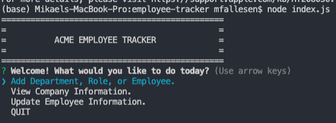
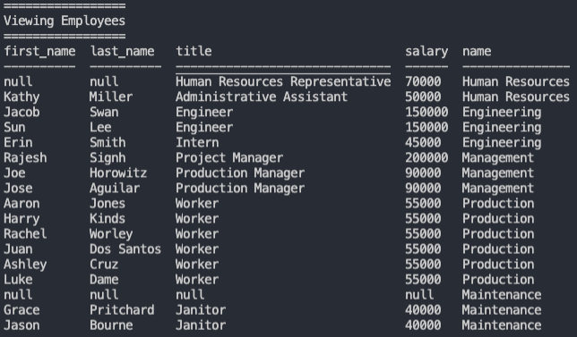
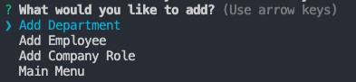
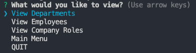
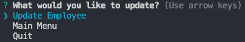

# ACME employee-tracker

## Description
This is a simple and  node CLI application that takes user input and allows you to manipulate you SQL database form the Command Line. It allows you a quick overview of you company including employees, roles, and departments. 

## Installation
Run `npm install` to install inquirer, mysql, and console.table npm packages.

(You can choose to omit console.table but it makes the table output much prettier. Just be sure to remove the dependency in index.js)

Use the provided `seed.sql` to populate your MYSQL server with some prebuilt data or use your own.

## Usage
Run the program using `node index.js`

You will be greeted by prompt about what you would like to do.

You can add as many employees, roles, and departments to your company as you like and track the information for each. 

Navigating around is simple with intuitive menus.

## License
This application is released under an MIT license.

## Contributing
This project is not currently accepting any contributions, but please feel free to check out the code and play around with it for yourself.